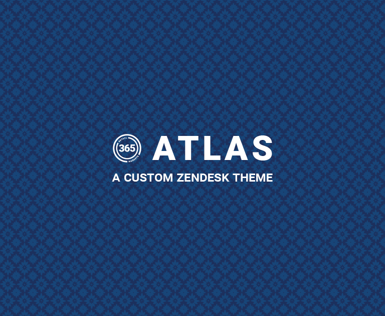

## About ATLAS:
Version 3 saw a complete rewrite of the entire codebase for all available Zendesk templates.
Design for the theme was done from a mobile-first perspective with an effort made to reduce file sizes and data consumption as much as possible, understanding that those who might need to access the information on the HelpCenter could be in locations with slow 3G connections.

## Some specific points in the new version include:
- Greatly improved template code quality
    - Proper indentations, fewer unnecessary tags, and no unused classes.
- Increased mobile device support.
- Using relative units where it matters and SVG instead of static units and PNG files.
- Reduced style.css filesize (down to 1383 lines from 6106!)
- Reduced script.js filesize (down to 118 lines from 380!)
    - Rewrote large portions of functions for improved speed and less bloat

- New design and style resources:
    - Updated Bootstrap version from version 3 to 4
    - Using Phosphor icons. Fun and small!
    - Articles now include useful utility elements for an enhanced reader experience

## Notes:
Heavily compressed header pattern from [Toptal Subtle Patterns](https://www.toptal.com/designers/subtlepatterns/moroccan-flower-dark-pattern/)

## Detailed changelog:
- `manifest.json`
    - Named version 3 of the theme to "Atlas"
    - I am the author of the theme
    - Increment version to 3.0.0
    - Use Zendesk's updated API (version 2)
    - Removed nearly all `settings` options. These options were left over from the stock Copenhagen theme and used in version 1 of the theme. Brand colors are highly unlikely to ever change and variables for these were not needed. These colors should also not be changed from within the theme settings in the Zendesk Guide Admin panel. Retained the "favicon" setting (we like the favicon. it is nice).

- `README.md`
    - uh hello

- `script.js`
    - Use only one `$(document).ready()` function. The whole script is loaded on every page anyway...
    - Removed a bunch of API calls that inserted buttons for specific groups of users. The results were jarring anyway.
    - Added names to functions so we know what is breaking
    - Removed a lot of scripts that eased various minutiae in or out of view or adjusted their size ever so slightly. If we can't pass strings to the jQuery animation to change the speed, we don't need another function to do it.
    - A lot of scripts were fighting HTML elements generated by Zendesk's curlybars templates by changing them or inserting new tags inside or after the generated ones. This can generally be worked around in CSS or through some tinkering with Bootstrap classes.
    - Rewrote script for "New Articles" on the `home_page.hbs` template. Much cleaner and faster.
    - Removed bits for "Release Notes" indicator. It didn't work properly and probably not in January.

- `style.css`
    - The entirety of the original CSS file was thrown out and rewritten from scratch. Some notes are below about choices made when writing new styles versus choices made in the old sheet.
    - Removed the "reset" CSS file prepended to the top of the sheet. It was fighting the Bootstrap reset and made some questionable changes.
    - Removed a lot of media queries. Bootstrap is really good at handling sizing of elements with Flexbox. Quite frankly, when I inherited this theme, I did not realize we were using Bootstrap because of all the media queries and other size adjustments.
    - So many elements were included for mobile sizes when they could have been resized instead (see above).
    - I tried to stick to a pattern when creating new classes, child class names containing parts of parent class names so the reader can understand what the class does and where it goes just by reading the name. Sometimes they get a little long.

- `thumbnail.png`
    - Fresh and new for the new theme!

- `assets/`
    - Removed all the now-useless home icons. They were not scalable and if, for any reason, your connection was slow enough, they would not load and rendered most of the home page useless.
    - The large banners were replaced with a very small, tile-able, pattern.
    - Replaced the PNG logos/images with SVG.

- `settings/`
    - Removed useless images.

- `templates/`
    - All templates were rewritten entirely, in the same manner as the CSS file. The structure remained relatively similar, just a lot more efficient.
    - Not all of them will be listed.

- `templates/article_page.hbs`
    - Removed "Related" and "Featured" articles
    - Removed sidebar advertisement
    - Worked with the Training team to understand needs and improve article styles.
    - Wrote a collection of article utility elements and classes

- `templates/category_page.hbs`
    - Rewrote category, section, and subsection styles for navigational clarity.

- `templates/community_*.hbs`
    - Filled with `error_page.hbs` contents as Zendesk Community is disabled.

- `templates/document_head.hbs`
    - Added `charset` and viewport `meta` tags.
    - Moved content hosting to JSDeliver
    - Added updated jQuery library

- `templates/footer.hbs`
    - Added a pop-up navigation assistant, similar to the old "Resources" link/dropdown in v2.

- `templates/header.hbs`
    - Stopped trying to cram so many things in the header.
    - Use a textual element for the title rather than an image.

- `templates/home_page.hbs`
    - Based on user survey, place the most used elements at the top of the page.
    - Place categories into expandable grids