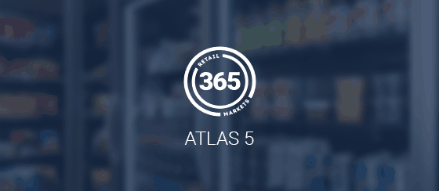

## About ATLAS v4:
This repository contains the [365 Retail Markets HelpCenter](https://help.365retailmarkets.com) theme running on the Zendesk Guide platform.

Version 4 focuses on clean code, BEM-like CSS principles, accessibility, and a dark mode addition.

### NOTE:
This repository contains a lot of brand-specific links and styling.  
It is not intended to be used as a theme on another Zendesk Guide instance.

Even so, I hope that it can act as a reference or starting point for creating your own Guide theme. Questions about scripts, templates, or the strange actions that Zendesk sometimes takes with its products are certainly welcome!

## Some specific points in the new version include:
- Even more improved template code quality
- BEM-like naming, reusable & component-ish classes
- Updated 3rd party utilities to latest versions
- Dark mode!
- SCSS templates
- CSS variables
- Segmented JS script files

## Project Structure:
- `assets/` - contains logos, images, stylesheets, and the segmented script files
- `settings/` - contains the favicon used in the `manifest.json` file
- `styles/` - contains all of the SCSS files, one for each template file
- `templates/` - contains all of the various page file templates
- `style.css` - final stylesheet used by Zendesk Guide
- `script.js` - main script file included in the page `<head>`
- `manifest.json` - project metadata and settings

### Templates
For markup Zendesk Guide uses [Handlebars](https://handlebarsjs.com/) and each template is stored in the [`templates/`](templates/) folder. All available templates for a Zendesk Guide theme that has all the features enabled are included however not all of them are used in our case (like "Community").

### Styles
The styles that Zendesk Guide will read are in the [`style.css`](style.css) file located in the project root.

For development this project uses the CSS preprocessor [Sass](https://sass-lang.com/) with the `.scss` syntax where we split styles into [Sass partials](https://sass-lang.com/guide#topic-4). All the partials are put under the [`styles/`](styles/) folder and included in the [`index.scss`](styles/index.scss) which is then compiled to [`style.css`](style.css).

`styles/_partial.scss` 🡆 `styles/index.scss` 🡆 `style.css`

All layout and positioning is written in the SCSS files. Any color/type/design is written in the `styles-light.css` and `styles-dark.css` files. If a style does not change based on the theme mode, then it may exist in the SCSS file.

### Scripts
The main JavaScript file [`script.js`](script.js) is located in the project root and will be added in the document `<head>` of every page.

JavaScript that you do not think belong in the document `<head>` can be added inline in [templates](#templates) or added as regular `*.js` files in the [assets folder](#assets-folder) and then be included in the appropriate template(s).

## Developing
To start contributing, clone the repository (`git clone https://github.com/ohitsdylan/365ZD.git`) and create a feature/bug branch (e.g. `git checkout -b feature/that-new-feature` or `bug/fix-for-that-bug`) to work on.

### Local previewing
You can use your favorite IDE to develop and preview your changes locally in a web browser using the Zendesk Apps Tools (ZAT) which is installed as a Ruby gem. For more details, see [Previewing theme changes locally](https://support.zendesk.com/hc/en-us/articles/115012793547).

To avoid having to enter your Zendesk credentials every time you start your development environment you can create a `.zat` file in the project root which contains your credentials in json format, for example like this:

```json
{
  "subdomain": "365retailmarkets",
  "username": "jh@365.rm/token",
  "password": "YOUR_API_TOKEN"
}
```

### npm tools
To make use of some development tools you will need to have [Node.js](https://nodejs.org/) installed and then run the below command:

```shell
npm install
```

In [`package.json`](package.json) you will find a list of the dev dependencies along with some [npm scripts](https://docs.npmjs.com/misc/scripts.html). Example on how to run a script:

```shell
# Watch Sass changes and write to style.css
npm run styles:watch

# Complies Sass, minify and autoprefix to style.css
npm run styles:build
```

## Committing Changes
When creating pull requests, please format your request according to the [Conventional Commits specification](https://www.conventionalcommits.org/en/v1.0.0/#summary).

### Format
Commit messages should contain a header. The scope of the header is optional. The body and footer are optional. If the message's type is `fix`, the footer should be included and contain a [closing reference to the issue](https://docs.github.com/en/issues/tracking-your-work-with-issues/linking-a-pull-request-to-an-issue).
```
<type>(<scope>): <subject>
<line break>
<body>
<line break>
<footer>
```

*Short Example:*
`fix(css): adjust warning callout text color to black`

*Long Example:*
```
fix: toast element blocking header search bar (#6)

Added a "d-none" class that is added/removed from/to the toast element after the opacity is set to zero/one.

Closes #6
```

### Types
Must be one of:
- *fix*: A bug fix
- *feat*: A new feature
- *refactor*: A code change that neither fixes a bug nor adds a feature
- *style*: Changes that do not affect the meaning of the code (white-space, formatting, missing semi-colons, etc)
- *docs*: Changes to the README or any other documentation

### Scopes
If included, should be one of:
- *html*: Changes to the templating files
- *css*: Changes to files in the `styles` folder, or the `style-light.css` or `style-dark.css` files
- *js*: Changes to any JavaScript file

If you feel a new type or scope should be implemented, please open a new issue and we can discuss it.

## Deploying
For deploying changes to production we use the [Zendesk GitHub integration](https://support.zendesk.com/hc/en-us/community/posts/360004400007), the workflow can be summarized to:

1. Increment the `version` in [`manifest.json`](manifest.json) (without this Zendesk won't recognize an update).
2. Commit your changes and merge your branch to the master branch.
3. In the [Zendesk Guide theming center](https://help.365retailmarkets.com/theming) press **Update from GitHub**.
4. Changes should now be live!

## Acknowledgments
- [@vinorodrigues for the dark mode script](https://github.com/vinorodrigues/bootstrap-dark-5/blob/main/docs/bootstrap-night.md)
- [Harry Roberts for excellent guidelines on writing CSS](https://cssguidelin.es)
- [Evoko for their well-written theme README and development process that I ~blatantly copied~ borrowed from](https://github.com/evoko/zendesk-theme)
